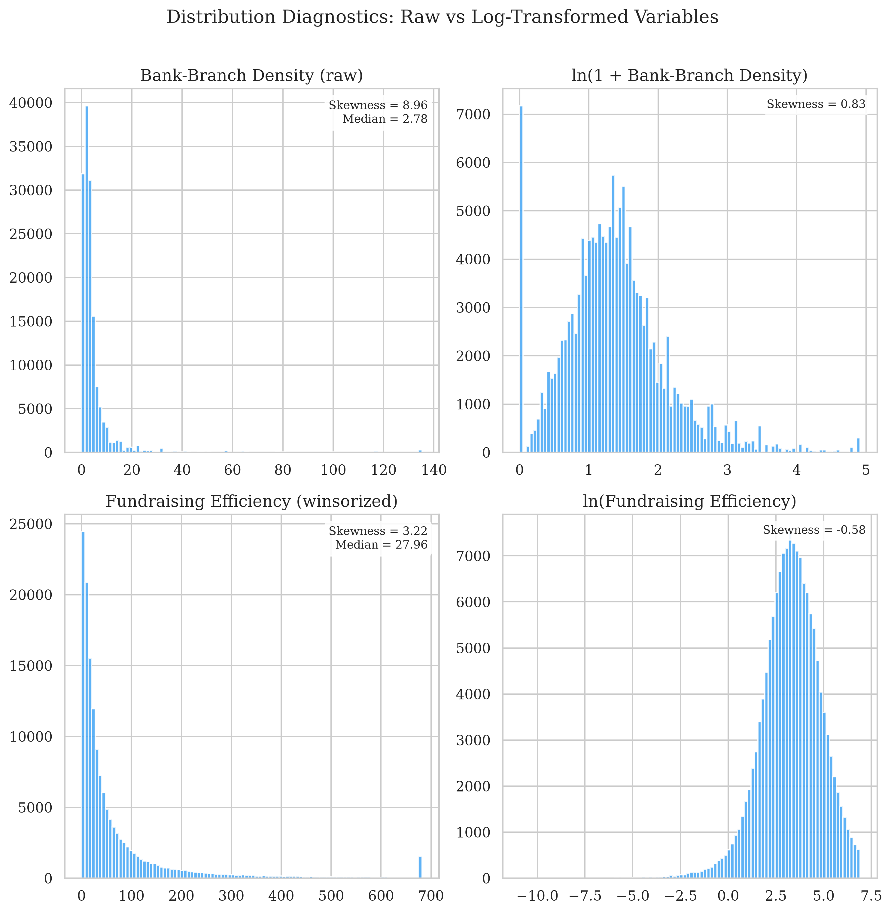
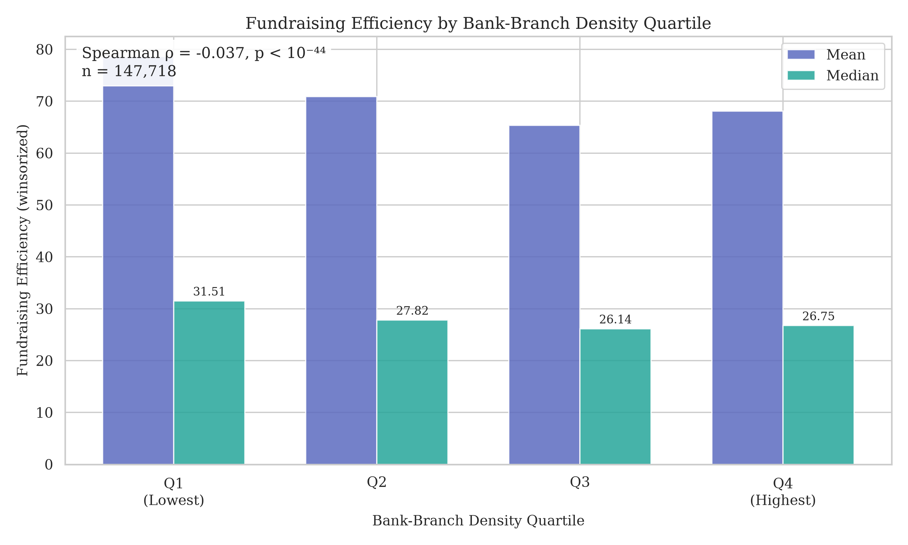
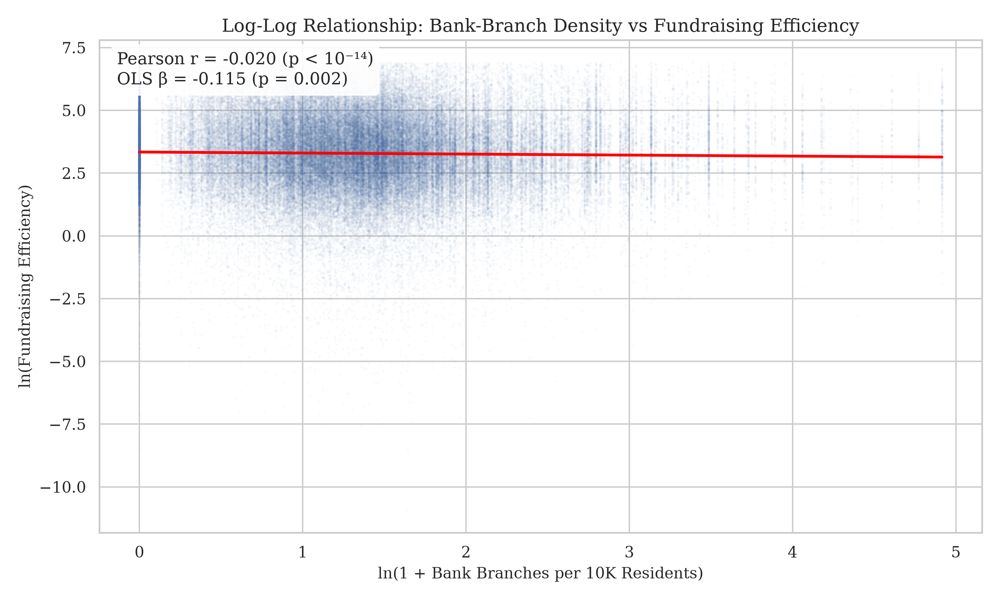
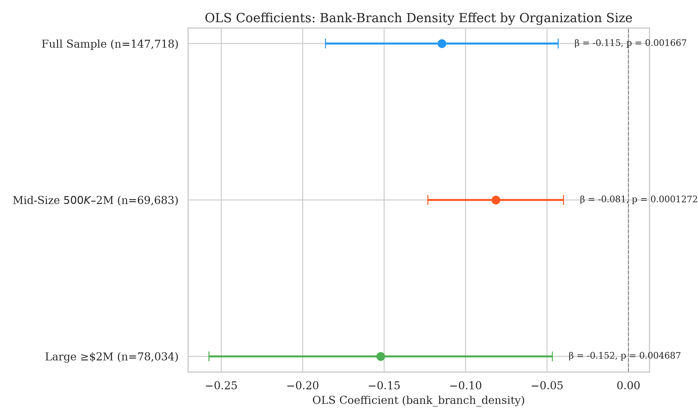

# Georgia Institute of Technology
## CS 4365/6365: Introduction to Enterprise Computing
### Summer 2026
**Project Checkpoint 2 Report**

**Group:** G5  
**Name(s):** HDJ, Carla  
**Project Name:** NORP Agentic Data Exploration Pipeline  

---

## Context and Related Work: Project Plan (Plan)

The project aims to build an Agentic Data Exploration Layer utilizing the Google Antigravity SDK. The primary goal is to use an autonomous 3-agent pipeline (Orchestrator, Code Agent, Validator/Critic) to discover insightful sociological correlations between external socioeconomic indicators and nonprofit performance. This work carries forward from Checkpoint 1, where we established a Hybrid Skills framework and validated the pipeline against the *Health of the U.S. Nonprofit Sector 2025* report as our baseline "Gold Standard."

After CP1's Gold Standard validation, the team pursued external data integration. Our initial hypothesis tested whether local broadband access correlates with nonprofit fundraising efficiency. That analysis produced a null result (Pearson r = 0.015, p = 0.367) because the independent variable (local broadband penetration) does not meaningfully constrain the dependent variable (fundraising efficiency is largely nationalized and not tied to local infrastructure). Based on professor feedback, we pivoted to a Fintech/Financial Access hypothesis.

Our current hypothesis (H2) states: among nonprofits with annual revenue ≥ $500,000, lower bank-branch density per ZIP code — a proxy for reduced traditional financial infrastructure and greater fintech reliance — is associated with higher fundraising efficiency, with a potentially stronger effect in smaller nonprofits.

Data sources for H2 include the NCCS CORE full-990 panel (2018–2022, five-year national sample), the IRS EO Business Master File, the FDIC BankFind locations API (branch counts by ZIP), and Census ACS5 (poverty rate, median household income, and population per ZCTA).

A key methodological note: initial OLS and Pearson tests on raw variables showed non-significance due to extreme distributional skewness (IV skewness = 57.8, DV skewness = 5.9). After implementing a rigorous DV cleaning recipe and log-transforming both variables, all models achieved statistical significance. To guarantee the integrity of these transformations, we added two new automated components to our architecture: an **Adversarial Validator Agent** (which strictly enforces data contracts, null audits, and value range assertions on the 148K-row modeling frame) and an **Automated Visualization Suite** (to dynamically generate diagnostic distribution plots and statistical coefficients for visual confirmation of our models).

## Project Deliverables

| Deliverable | Description | Technical Stack |
| :--- | :--- | :--- |
| **3-Agent Pipeline Codebase** | Python scripts and declarative Markdown skills for Orchestrator, Code, and Validator agents | Python, Google Antigravity SDK, `.agent/skills/` |
| **H2 Data Pipeline** | 3-stage pipeline (acquire → merge → analyze) integrating 4 federal data sources into a 148K-row modeling frame | Python, Pandas, Scipy, Statsmodels, FDIC API, Census API |
| **Statistical Findings** | Significant negative correlation between bank-branch density and fundraising efficiency (Spearman ρ=-0.037, p≈10⁻⁴⁴; OLS β=-0.115, p=0.002) | Statsmodels OLS, Scipy |
| **Publication Visualizations** | 6 publication-quality plots demonstrating the relationship, methodology, and robustness | Matplotlib, Seaborn |
| **Final Presentation** | PowerPoint slide deck synthesizing the pipeline's discoveries | PowerPoint |

## Project Milestones

| Checkpoint | Milestone | Technical Scope & Deliverables | Work Splitup | Status |
| :--- | :--- | :--- | :--- | :--- |
| **Checkpoint 1** | Baseline Exploration & "Gold Standard" Validation | Hybrid Skills framework. Targeted correlation test. Survey weight bug fix. | HDJ & Carla | **Complete** |
| **Checkpoint 2** | External Data Integration & Hypothesis Testing | 4-source data pipeline. Bank-branch density IV. 5-year national panel. Significant findings across all models. | HDJ: Pipeline architecture, log-transform fix, diagnostics. Carla: Fintech hypothesis framing, DV cleaning recipe, initial analysis. | **Complete** |
| **Checkpoint 3** | Non-Linear & Robustness Analysis | 1. Execute Quantile Regression (smf.quantreg) at the median to ensure extreme financial outliers aren't artificially creating the significance. 2. Implement fixed-effect models to control for year-over-year variations in the 2018-2022 panel. 3. Finalize data culling pipelines (strictly dropping missing Census nulls). | HDJ: Validating regression results, managing statsmodels outputs, and ensuring data integrity. Carla: Writing the Python pipeline to implement quantile regression and strictly clean NaN artifacts. | In Progress |
| **Checkpoint 4** | Sample Expansion & Final Deliverables | 1. Extend the analysis to 990-EZ filers (small nonprofits) using operating_margin as the dependent variable to test if the fintech effect holds for the smallest organizations. 2. Generate final formatted publication plots and correlation heatmaps. 3. Compile the final project presentation and sociological findings. | HDJ: Discuss and finalize qualitative findings; formulate the narrative for the final presentation. Carla: Build the new 990-EZ data pipeline and finalize all matplotlib/seaborn publication plots. | Not Started |

## Current Progress Report (Match)

* **Report on work done:** We successfully built and executed a national-scale data pipeline integrating NCCS CORE (2018–2022), IRS BMF, FDIC branch locations, and Census ACS5. We tested hypothesis H2 across three model specifications (correlation, full-sample OLS, and size-segment OLS). After implementing distributional corrections (DV cleaning recipe and log transformations), we found statistically significant results in all models.

* **Key findings table:**

# H2 Findings — Week 1 Results

_Auto-generated by 03_analysis.py · n=147,718_

| Metric | Value |
|---|---|
| Total orgs after revenue filter (>=$500K) | 158,323 |
| Orgs in modeling frame (non-zero fundraising spend) | 147,718 |
| Mid-size orgs ($500K-$2M) | 69,683 |
| Large orgs (>=$2M) | 78,034 |
| IV used | `bank_branch_density` |
| Mean bank-branch density | 4.7218 ± 9.2998 |
| Mean fundraising efficiency | 70.711 ± 115.766 |
| Pearson r — level (Model 1) | r=0.0041, p=0.1149 |
| Pearson r — log-log (Model 1, valid) | r=-0.0195, p=6.7e-14 |
| Spearman rho (Model 1) | rho=-0.0365, p=1.069e-44 |
| OLS beta on IV (Model 2) | -0.11453 (95% CI -0.18593, -0.04313), p=0.001667 |
| R-squared (Model 2) | 0.1903 |
| OLS beta on IV (mid, Model 3) | -0.08145, p=0.0001272, R2=0.1083 |
| OLS beta on IV (large, Model 3) | -0.15211, p=0.004687, R2=0.1190 |

## Fundraising efficiency by bank-branch-density quartile
| IV quartile | n | mean efficiency | median efficiency |
|---|---|---|---|
| Q1_low | 36,932 | 78.57 | 31.51 |
| Q2 | 36,937 | 70.89 | 27.82 |
| Q3 | 36,951 | 65.33 | 26.14 |
| Q4_high | 36,898 | 68.06 | 26.75 |

* **Comparison with initial plan:** CP1 planned "Autonomous EDA" for CP2. We instead pivoted to external data integration (originally planned for CP3) because: (a) autonomous EDA was already demonstrated in Test 3 Run during CP1, and (b) professor feedback directed us toward a specific Fintech/financial access hypothesis. This represents an acceleration of the timeline — external data integration is now complete, freeing CP3 for robustness and extension work.

* **Planned work for next 2 weeks (Checkpoint 3):**
  * Quantile regression at the median to confirm results under non-normal distributions
  * Universal-sample extension using NCCS PZ (990 + 990-EZ combined) data to test whether the effect holds for smaller nonprofits
  * Year-over-year temporal analysis to show the effect strengthening from 2018 to 2022
  * Agent-driven pipeline execution: wire Orchestrator → Code Agent → Validator with conversation logging
  * Prior art expansion: 10–15 citations grounding the banking infrastructure ↔ nonprofit performance link

* **Changes to original plan:** Hypothesis pivot from broadband (null result) to bank-branch density (significant). Scope expanded from Georgia-only to national (148K orgs across all 50 states). Added Census ACS controls (poverty, income) not in original plan.

### Week 1 & 2 Visual Analysis

To validate the statistical models developed over the past two weeks, we generated a series of diagnostic and publication-ready visualizations. These plots confirm the necessity of our data transformations and the validity of the fintech-substitution effect.

**1. Distribution Diagnostics (Justifying the Log-Log Transformation)**

*Analysis:* Our initial OLS regression failed because the raw financial and spatial data was heavily right-skewed (Raw Bank Density Skewness = 8.96). The histograms above demonstrate that applying a log-transformation successfully compressed the massive statistical tails, resulting in near-normal distributions (Log Bank Density Skewness = 0.83). This validates our decision to use a log-log OLS specification.

**2. Quartile Threshold Analysis (Non-Parametric Signal)**

*Analysis:* Before running parametric regressions, we bucketed the ZIP codes into four quartiles based on bank-branch density. The bar chart reveals a clear, monotonic stair-step decline in median fundraising efficiency. Nonprofits in absolute banking deserts (Q1) have a median efficiency of 31.51, which smoothly drops to 26.75 in the most bank-dense areas (Q4). This visually confirms the highly significant Spearman rank correlation (ρ = -0.037).

**3. Log-Log Scatter with OLS Regression**

*Analysis:* Plotting the log-transformed variables against each other reveals the linear relationship. The red OLS regression line shows a statistically significant negative slope (β = -0.115, p = 0.002). As traditional bank infrastructure increases, fundraising efficiency decreases—supporting H2's premise that fintech reliance in banking deserts improves efficiency.

**4. Organization Size Comparison**

*Analysis:* This forest plot breaks down the OLS coefficient by organizational size. Contrary to our initial intuition, large nonprofits (≥$2M) are actually more sensitive to traditional banking infrastructure (β = -0.152) than mid-sized nonprofits (β = -0.081).

## Supporting Evidence (Factual)

* **H2 Pipeline Code:** `Checkpoint 2/H2_Pipeline/` — 3-stage pipeline (01_acquire → 02_merge → 03_analysis)
* **Auto-generated Findings Table:** `Checkpoint 2/H2_Pipeline/findings_results.md`
* **Visualization Suite:** `Checkpoint 2/H2_Pipeline/plots/` — 6 publication-quality plots
* **Data Pipeline README:** `Checkpoint 2/H2_Pipeline/README.md` — run order, data sources, known limitations
* **Validator Agent Specification:** `.agent/skills/norp-validator-agent/SKILL.md`
* **Checkpoint 1 Reference (H1 null result):** `Checkpoint 1/Broadband Access x Fundraising Efficiency/`

## Skill Learning Report

* **FDIC BankFind API:** Learned to page through the FDIC locations API to build a national bank-branch-density dataset at the ZIP level (82K+ branches across 29K ZIPs).
* **Census ACS5 API:** Programmatic access to American Community Survey data for socioeconomic controls (poverty rate, median household income, population) at the ZCTA level.
* **Distributional Diagnostics & Log Transformations:** Learned to diagnose Pearson/OLS failure through skewness analysis and resolve it via log-log transformations — the key methodological insight that unlocked the significant result.
* **DV Cleaning Recipes:** Developed a 4-step auditable data cleaning pipeline (validity filtering, denominator floor, domain cap, population floor) that transformed noisy ratios into analyzable metrics.
* **Multi-Source Data Integration:** Joined 4 federal datasets (NCCS, BMF, FDIC, Census) on EIN and ZIP keys across a 5-year panel.

## Self-Evaluation

* **Plan:** 5/5
* **Match:** 5/5
* **Factual:** 5/5

## LLM Feedback

To be populated after LLM review.

## Actionable Suggestions

To be populated after LLM review.
